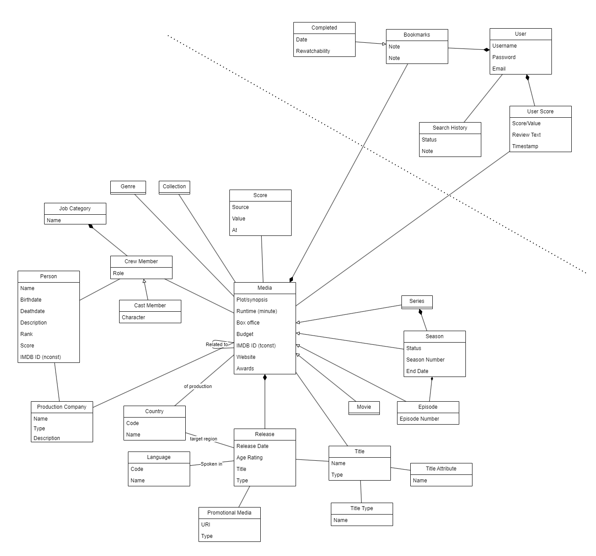

# portfolio_subproject_1  
Portfolio Subproject made for the CIT 2024 course

## Entity Relationship diagram

### Core Data Model

## Domain Model

## Term Glossary

### Country

- **IMDb language code**
	- *The language code IMDb uses to identify a language for a media*

- **ISO Code**
	- *A unique code for each country based on [ISO 3166-3](https://en.wikipedia.org/wiki/ISO_3166-1_alpha-2) standard*

- **Name**
	- *Name of the country*

### Language

- **IMDb language code**
	- *The language code IMDb uses to identify a language for a media*

- **ISO Code**
	- *A unique code for each language based on [ISO 639-3](https://en.wikipedia.org/wiki/ISO_639-1) standard*

- **Name**
	- *Name of the language*

### Job Category
*The profession of a person work on a media.*

- **Name**
	- *unique name of*

### Media
*Media represents movies, series, episodes—basically any type of media content that can be consumed by a user of the site.*

- **Title**
	- *Main title for a media.*

- **Release Date**
	- *The original date that the current media was released.*

- **Language**
	- *The language spoken in the media.*

- **Plot**
	- *Description/Synopsis of the media.*

- **Age Rating**
	- *This could be, for example, PEGI, PG-13, R, and so on.*

- **Country**
	- *The country where the media was produced.* (Can currently represent multiple countries.)

- **Runtime**
	- *The runtime of the media in minutes.*

- **Box Office**
	- *A representation of the media's gross earnings for the first month after release.*

- **Budget**
	- *The budget set for the media.*

- **IMDB_ID**
	- *An ID reference to IMDB for the media, this is called **TCONST**.*

- **Website**
	- *A promotional website for the media.*

- **Awards**
	- *This includes nominations, awards, and so on.*

### Release
*A media can have several releases. This table can represent these alternative releases of a media. It also allows us to see in which regions and in what format the media was released.*

- Language
	- *The language spoken in the media or the language for which it is intended.*

- Region
	- *The country where the release occurred.*

- Release Date
	- *The date of the release.*

- Title
	- *The title in that specific language.*

- Title Type
	- *The different types of release, e.g., DVD, premiere.*

### Title

### Score
*An overview of the scores for a specific media.*

- Source 
	- *The source of the score value, e.g. Metacritic, IMDB, Rotten Tomatoes, etc.*

- Value 
	- *The average score from this source.*

- At
	- *The time of when the score was collected.*

### Crew Member
*The person working on a media.*

- Role
	- *The title of the job/role which the person performed on the movie. E.g. crew member was an actor but their role was the 'Lead' of the movie*

#### Cast Member
*An actor on performing in a media.*

- Character
	- *The name of the character the actor played.*

### Person
*A person that has been involved with the making of a type of media.*

- Name
	- *Full name of the person. Consists of '{First names} {middle names} {last name}'*

- Birth Date
	- *The date of birth.*

- Death Date
	- *The date of death.*

- Description
	- *General description of the person in full text.*

- Rank
	- *A rank based on the score, also considering different actors.*

- Score
	- *The score calculated based on all the media that the person has been a part of.*

- IMDB_ID
	- *The ID of the corresponding person in the IMDB dataset. NCONST.*

### Series
*A type of media that is a series.*

- Empty

### Season
*The specific season of a series.*

- Status
	- *The state of the current season, e.g., finished.*

- Season Number
	- *The number of the season.*

- End Date
	- *The date that the specific season ended.*

### Episode
*The specific episode of a series in a specific season.*

- Episode Number
	- *The number of the episode.*

### Collection
*A grouping of related media.*

- Empty

### Genre
*A grouping of a media's specific genre/topic.*

- Name
	- *The name of the genre.*

### Movie
*A type of media representing a movie.*

- Empty

### Promotional Media
*Multimedia used to promote a media release.*

- URI
	- *The digital location of where the media is stored.*

- Type
	- *The type of multimedia, e.g., poster, video, image.*

### Production Company
*The company that has been involved in making a type of media.*

- Name
	- *The name of the company.*

- Description
	- *Short text about the company.*

- Type
	- *The type of company, e.g., studio, production.*

### Bookmarks
*The saved media that a user wants to return to.*

- Note
	- *The user's personal note regarding that media.*

#### Completed
*A bookmark of media that the user has finished.*

- Date
	- *The date that the user finished watching the media.*

- Rewatchability
	- *How likely the user is to watch the media again.*

#### Plan To Watch
*A bookmark of media that the user has planned to watch.*

- Empty

### User
*A user of the movie database/site.*

- Username
	- *The username of the user.*

- Password
	- *The password for the account.*

- Email
	- *The user's email.*

### User Score
*A user's rating of a media.*

- Score
	- *A value from 1-10.*

- Review Text
	- *A note about the media.*

### Search History
*The history of the user's searches.*
