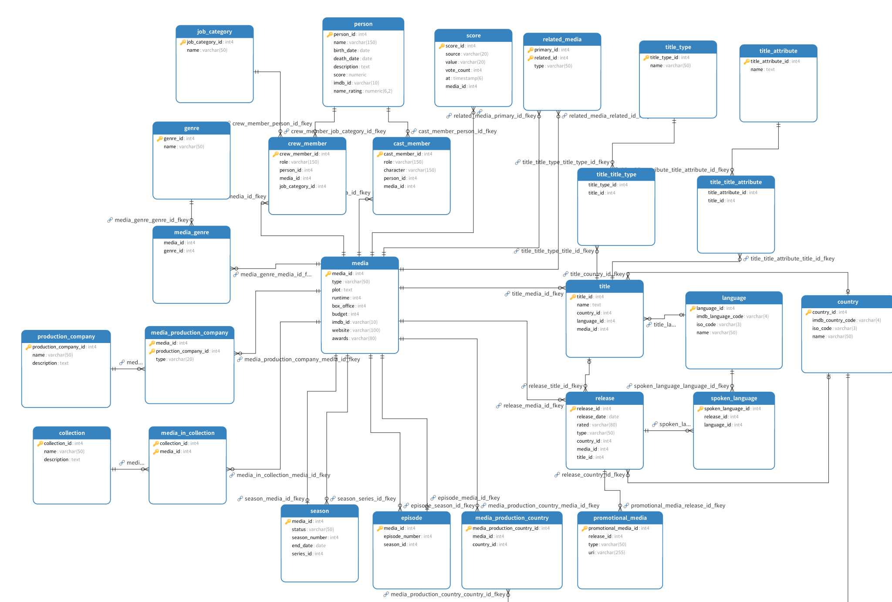

# Subproject 1: Database

## Overview

This project is part of a Complex IT Systems practice course. The goal is to build a multi-user movie database that allows users to search for, browse, rate, and compare movies and actors. It supports features like tracking search history, rating, and bookmarking movies. The project is divided into multiple subprojects, focusing on database creation, backend services, and frontend interfaces.

This guide covers **Subproject 1: Database**, focusing on setting up the database, importing data, and implementing core functionalities.

---

## Prerequisites

- **PostgreSQL** installed on your system.
- Command-line psql.
- The following backup files:
  - `imdb.backup`
  - `omdb_data.backup`
  - `wi.backup`

The backup files can be located in the `data` folder. They are currently split, and can be reassembled again by running the python script `data.py`.

---

## Step 1: Importing Data

We start by importing the three key datasets into your PostgreSQL database:

1. **IMDb Backup** – Contains movie and actor data.
2. **OMDb Backup** – Supplements the IMDb data with additional metadata like posters and plot descriptions.
3. **Word Index Backup** – Provides an inverted index for efficient searches based on movie titles, plots, characters, and actor names.

### Commands to Run

Open your terminal and navigate to the directory where the backup files are stored. Run the following commands:

```bash
psql -U postgres -c "create database movie"
psql -U postgres -d movie -f imdb.backup
psql -U postgres -d movie -f omdb_data.backup
psql -U postgres -d movie -f wi.backup
```

#### Backup File Details

- **`imdb.backup`**: A reduced IMDb dataset containing around 130,000 movies and 470,000 personalities. It includes basic information about titles, cast, crew, and ratings.
- **`omdb_data.backup`**: Supplementary data from the Open Movie Database (OMDb), including unique features like movie posters and plot descriptions.
- **`wi.backup`**: An inverted index for faster lookups based on textual data like titles, plots, character names, and actor names.

---

## Step 2: Running SQL Scripts

After importing the data, run the following scripts in sequence to build the database structure and implement the required functionalities.

### 1. **B2 Script: Building the Core Database**

Run the B2 script to build the core database structure, including tables and relationships:

```bash
psql -U postgres -d movie -f B2_build_movie_db.sql
```

- **Purpose**: Creates the essential tables and constraints for managing the movie data in your database.

### 2. **C2 Script: Adding the Framework**

Execute the C2 script, which adds a framework for managing additional features like user interactions, ratings, and search history:

```bash
psql -U postgres -d movie -f C2_build_framework.sql
```

- **Purpose**: Adds user-related features and functionalities, such as the ability to bookmark, rate, and plan to watch movies.

### 3. **D Script: Implementing Functions and Procedures**

Now, execute the D script, which contains all the functions and stored procedures for managing the movie data and user interactions:

```bash
psql -U postgres -d movie -f D_functions_and_procedures.sql
```

- **Purpose**: Contains advanced functions that allow users to search for movies, manage their ratings, and interact with the movie data in various ways.

---

## Step 3: Testing the Database Functionality

To ensure that everything is working correctly, run the test script:

```bash
psql -U postgres -d movie -f test_functions.sql
```

- **Purpose**: Tests the functions and procedures defined in the D script, ensuring they operate correctly with the imported data.

---

## Detailed Breakdown of the Files

### Backup Files

1. **`imdb.backup`**
   - **Purpose**: Contains the IMDb dataset, which includes movies, actors, directors, and other metadata.
   - **Tables Included**:
     - `title_basics`: Basic information about movie titles.
     - `title_principals`: Cast and crew details.
     - `title_ratings`: Movie ratings.

2. **`omdb_data.backup`**
   - **Purpose**: Holds additional metadata from OMDb, such as external ratings, reviews, or movie details.
   - **Additional Data**:
     - `poster`: Links to movie posters.
     - `plot`: Plot descriptions of movies.

3. **`wi.backup`**
   - **Purpose**: Provides an inverted index for text-based search functionality.
   - **Includes**:
     - Words from movie titles, plot descriptions, character names, and actor names.

### SQL Scripts

1. **`B2_build_movie_db.sql`**
   - **Purpose**: Builds the core database structure, including tables for storing movie data.
   - **Key Tables**: Titles, ratings, and other essential data.

2. **`C2_build_framework.sql`**
   - **Purpose**: Adds user-related features, allowing for user-specific data like ratings, bookmarks, and planned-to-watch lists.
   - **Key Features**: User management, bookmarking functionality, and search history tracking.

3. **`D_functions_and_procedures.sql`**
   - **Purpose**: Defines functions and procedures to manage the database, including search functionalities and user interactions.
   - **Key Functions**:
     - Search for movies based on titles or plot keywords.
     - Rate movies and track user interactions.
     - Retrieve bookmarked titles and rating history.

4. **`test_functions.sql`**
   - **Purpose**: Tests the functions and procedures created in the D script to ensure they are working correctly.
   - **Functionality**: Runs sample queries and verifies that results are correct.

---

## Future Steps

In the subsequent subprojects, we will focus on:

- **Subproject 2**: Implementing backend services that allow for data manipulation via APIs.
- **Subproject 3**: Developing a frontend to interact with the backend services, creating a user-friendly web application.

---

## Entity Relationship diagram



---

## Domain Model

---


---

## Term Glossary

### Country

- **IMDb language code**
	- *The language code IMDb uses to identify a language for a media*

- **ISO Code**
	- *A unique code for each country based on [ISO 3166-3](https://en.wikipedia.org/wiki/ISO_3166-1_alpha-2) standard*

- **Name**
	- *Name of the country*

### Language

- **IMDb language code**
	- *The language code IMDb uses to identify a language for a media*

- **ISO Code**
	- *A unique code for each language based on [ISO 639-3](https://en.wikipedia.org/wiki/ISO_639-1) standard*

- **Name**
	- *Name of the language*

### Job Category
*The profession of a person work on a media.*

- **Name**
	- *unique name of*

### Media
*Media represents movies, series, episodes—basically any type of media content that can be consumed by a user of the site.*

- **Title**
	- *Main title for a media.*

- **Release Date**
	- *The original date that the current media was released.*

- **Language**
	- *The language spoken in the media.*

- **Plot**
	- *Description/Synopsis of the media.*

- **Age Rating**
	- *This could be, for example, PEGI, PG-13, R, and so on.*

- **Country**
	- *The country where the media was produced.* (Can currently represent multiple countries.)

- **Runtime**
	- *The runtime of the media in minutes.*

- **Box Office**
	- *A representation of the media's gross earnings for the first month after release.*

- **Budget**
	- *The budget set for the media.*

- **IMDB_ID**
	- *An ID reference to IMDB for the media, this is called **TCONST**.*

- **Website**
	- *A promotional website for the media.*

- **Awards**
	- *This includes nominations, awards, and so on.*

### Release
*A media can have several releases. This table can represent these alternative releases of a media. It also allows us to see in which regions and in what format the media was released.*

- Language
	- *The language spoken in the media or the language for which it is intended.*

- Region
	- *The country where the release occurred.*

- Release Date
	- *The date of the release.*

- Title
	- *The title in that specific language.*

- Title Type
	- *The different types of release, e.g., DVD, premiere.*

### Title

### Score
*An overview of the scores for a specific media.*

- Source 
	- *The source of the score value, e.g. Metacritic, IMDB, Rotten Tomatoes, etc.*

- Value 
	- *The average score from this source.*

- At
	- *The time of when the score was collected.*

### Crew Member
*The person working on a media.*

- Role
	- *The title of the job/role which the person performed on the movie. E.g. crew member was an actor but their role was the 'Lead' of the movie*

#### Cast Member
*An actor on performing in a media.*

- Character
	- *The name of the character the actor played.*

### Person
*A person that has been involved with the making of a type of media.*

- Name
	- *Full name of the person. Consists of '{First names} {middle names} {last name}'*

- Birth Date
	- *The date of birth.*

- Death Date
	- *The date of death.*

- Description
	- *General description of the person in full text.*

- Rank
	- *A rank based on the score, also considering different actors.*

- Score
	- *The score calculated based on all the media that the person has been a part of.*

- IMDB_ID
	- *The ID of the corresponding person in the IMDB dataset. NCONST.*

### Series
*A type of media that is a series.*

- Empty

### Season
*The specific season of a series.*

- Status
	- *The state of the current season, e.g., finished.*

- Season Number
	- *The number of the season.*

- End Date
	- *The date that the specific season ended.*

### Episode
*The specific episode of a series in a specific season.*

- Episode Number
	- *The number of the episode.*

### Collection
*A grouping of related media.*

- Empty

### Genre
*A grouping of a media's specific genre/topic.*

- Name
	- *The name of the genre.*

### Movie
*A type of media representing a movie.*

- Empty

### Promotional Media
*Multimedia used to promote a media release.*

- URI
	- *The digital location of where the media is stored.*

- Type
	- *The type of multimedia, e.g., poster, video, image.*

### Production Company
*The company that has been involved in making a type of media.*

- Name
	- *The name of the company.*

- Description
	- *Short text about the company.*

- Type
	- *The type of company, e.g., studio, production.*

### Bookmarks
*The saved media that a user wants to return to.*

- Note
	- *The user's personal note regarding that media.*

#### Completed
*A bookmark of media that the user has finished.*

- Date
	- *The date that the user finished watching the media.*

- Rewatchability
	- *How likely the user is to watch the media again.*

#### Plan To Watch
*A bookmark of media that the user has planned to watch.*

- Empty

### User
*A user of the movie database/site.*

- Username
	- *The username of the user.*

- Password
	- *The password for the account.*

- Email
	- *The user's email.*

### User Score
*A user's rating of a media.*

- Score
	- *A value from 1-10.*

- Review Text
	- *A note about the media.*

### Search History
*The history of the user's searches.*
